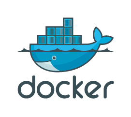
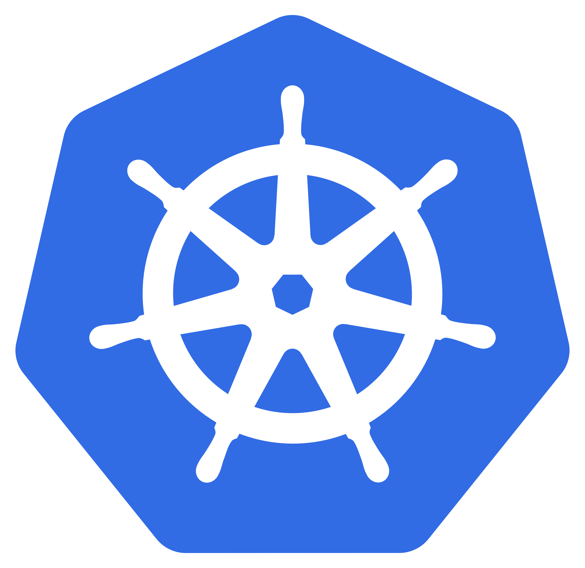

# Container Orchestration
> Chennai Docker Meetup: March 2017

---

## Who am I?
- Mohanarangan Muthukumar
- github.com/extrasalt
- extrasalt.org

---



---

### Docker
- Cgroups and namespaces
- Application containers vs Machine containers
- Shipping your machine
- Communication only through ports

---

Pull the image
```
$ docker pull alpine
```

Run a command inside the container
```
$ docker run alpine ls -l
```

Create a container and attach to it
```
$ docker run -it alpine /bin/sh
```

---

```
$ docker ps -a
CONTAINER ID        IMAGE               COMMAND                  CREATED             STATUS                    PORTS               NAMES
75836ff40596        bfe2567e680b        "/bin/sh -c '#(nop..."   2 days ago          Created                                       loving_pasteur
84ba520e5ac8        postgres            "docker-entrypoint..."   2 weeks ago         Exited (0) 19 hours ago                       postgres
```

---

### What is orchestration?
- Manage resources
- Schedule tasks
- Monitoring
- Managing the tasks

---

## Swarm mode

---
Manager Node
```
$ docker swarm init --advertise-addr=192.168.2.5
```
Swarm node
```
$ docker swarm join \
    --token SWMTKN-1-43ae9q0vh499awlv7ojtgiuqz6zagze4wlaxh8gae50wxdi0nt-4ohknvwz3p45uqhptj9zh0ep8 \
    192.168.2.5:2377
```

---

- Easy to setup. Docker-machine and docker swarm init
- It has an internal raft implementation
- Imperative vs Declarative

---


---

Why do we need it?

---

- Mesos master, mesos slave
- Frameworks
- Applications

---

Two-level scheduling

---

- Marathon
- Chronos

---

Why not mesos? Pre-dates containers and schedules jobs instead of pods.

---



---

> Jobs are restrictive as the only grouping mechanism
for tasks... it’s not possible to
refer to arbitrary subsets of a job, which leads to problems
like inflexible semantics for rolling updates and job resizing.
> 
> <small>Large-scale cluster management at Google with Borg, Google Inc.</small>

---

### Primitives
- Pods
- Nodes
- Namespaces
- Service

---

### Higher level constructs
- Replicasets
- Statefulsets
- Daemonsets
- Deployments
- Jobs

---

### How to setup kubernetes? [Hint: Nightmare]
- minikube
- Juju for Canonical distribution of kubernetes
- Kargo
- Kops
- Terraform
- Bootkube
- Just use GKE

---

How to use Kubernetes?
Kubectl/Kubernetes API

---

## Container orchestrator
- Manages resources (nodes)
- Schedules tasks (Pods)
- Monitors tasks
- Gives you a way to manage tasks (kubectl and the API)

---

## Operating system kernel
- Manages resources
- Schedules tasks
- Monitors tasks
- Gives you a way to manage tasks

---

> We must treat the datacenter itself as one massive warehouse-scale computer (WSC)
> 
> <small>Luiz André Barroso, Urs Hölzle Datacenter, The Data Center as a Computer</small>

---

Kubernetes is the kernel of the datacenter

---

Running kubernetes on VMs is wasteful

---

# Podder
> github.com/extrasalt/podder

---

- Can deploy self-contained golang binaries
- By just drag dropping
- It's multi-tentant

---

# Demo time*
> *if God wills it.

---

@extrasaltorg

Thank you.

```