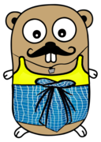
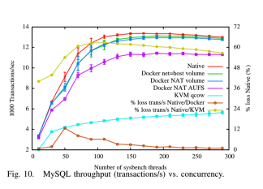

# Building a Baremetal Go PaaS with Kubernetes
> Chennai Golang Meetup: March 2017

---

## Who am I?
- Mohanarangan Muthukumar
- github.com/extrasalt
- extrasalt.org

---

## Pre-2013

---

---

---

Go fixed the top layers.

---

---

...We have few more layers

---

### How do you deploy a go app on the cloud?
- Compile your binary
- Create a dockerfile
- Add a base OS
- Add your binary
- Chmod it
- Set it as entrypoint
- Make an image with the dockerfile
- Upload the image to a registry
- Pull the image on your nodes and run

---

Running Containers on VMs is wasteful

---

> We also question the practice of deploying containers inside VMs, since this imposes the performance overheads of VMs while giving no benefit compared to deploying containers directly on non-virtualized Linux.
>
> <small>An Updated Performance Comparison of Virtual Machines and Linux Containers - IBM, 2014</small>

---

---

### Linux containers
- Cgroups and namespaces
- Abstraction of a machine
- Shipping your machine
- Communication only through ports
- Stateless (No process migration)

---

---

### Primitives
- Nodes
- Namespaces
- Service
- Pods

---

### Higher level constructs
- Replicasets
- Statefulsets
- Daemonsets
- Deployments
- Jobs

---

## Container orchestrator
- Manages resources (nodes)
- Schedules tasks (Pods)
- Monitors tasks
- Gives you a way to manage tasks (kubectl and the API)

---

## Operating system kernel
- Manages resources
- Schedules tasks
- Monitors tasks
- Gives you a way to manage tasks

---

> We must treat the datacenter itself as one massive warehouse-scale computer (WSC)
>
> <small>Luiz André Barroso, Urs Hölzle - Datacenter, The Data Center as a Computer</small>

---

Kubernetes is the kernel of the datacenter
> You don't have to take my word for it

---

> The master is the kernel of a distributed system.
Borgmaster was originally designed as a monolithic system, but over time, it became more of a kernel sitting at the heart of an ecosystem of services that cooperate to manage user jobs.
>
> <small>Large-scale cluster management at Google with Borg, Google Inc.</small>

---

# Podder
> github.com/extrasalt/podder

---

- Userspace for the system built with kubernetes as the kernel
- Can deploy self-contained golang binaries
- By just drag dropping
- It's multi-tenant

---

Go is a movement.

---

slack:@mohan
@extrasaltorg
github.com/extrasalt
extrasalt.org

Thank you.
