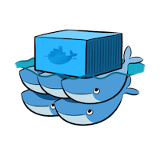
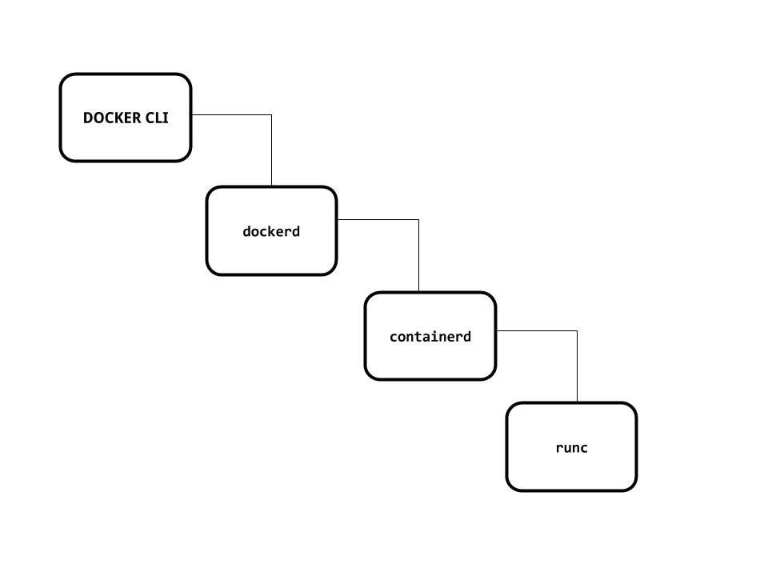

---

## Who am I?
**Mohanarangan Muthukumar**

- extrasalt.org
- github: @extrasalt
- twitter: @extrasaltorg

---

# Dissecting Docker Containers
> Chennai Docker Meetup: September 2017

---

## What is Docker?
WorksOnMyMachine™

---

Something.. Shipping container

---

## How to do this docker thing?
Pull the image
```
$ docker pull alpine
```

Run a command inside the container
```
$ docker run alpine ls -l
```

Create a container and attach to it
```
$ docker run -it alpine /bin/sh
```

---

```
$ docker ps -a
CONTAINER ID        IMAGE               COMMAND                  CREATED             STATUS                    PORTS               NAMES
75836ff40596        bfe2567e680b        "/bin/sh -c '#(nop..."   2 days ago          Created                                       loving_pasteur
84ba520e5ac8        postgres            "docker-entrypoint..."   2 weeks ago         Exited (0) 19 hours ago                       postgres
```

---

### Docker
- Cgroups and namespaces
- Application containers vs Machine containers
- Shipping your machine
- Communication only through ports

---



---

Manager Node
```
$ docker swarm init --advertise-addr=192.168.2.5
```
Swarm node
```
$ docker swarm join \
    --token SWMTKN-1-43ae9q0vh499awlv7ojtgiuqz6zagze4wlaxh8gae50wxdi0nt-4ohknvwz3p45uqhptj9zh0ep8 \
    192.168.2.5:2377
```

---

Let's Dissect

---



---

Containerd

---

Runc

---


---

Namespaces

---

## Thank you.
**Mohanarangan Muthukumar**

- extrasalt.org
- github: @extrasalt
- twitter: @extrasaltorg
