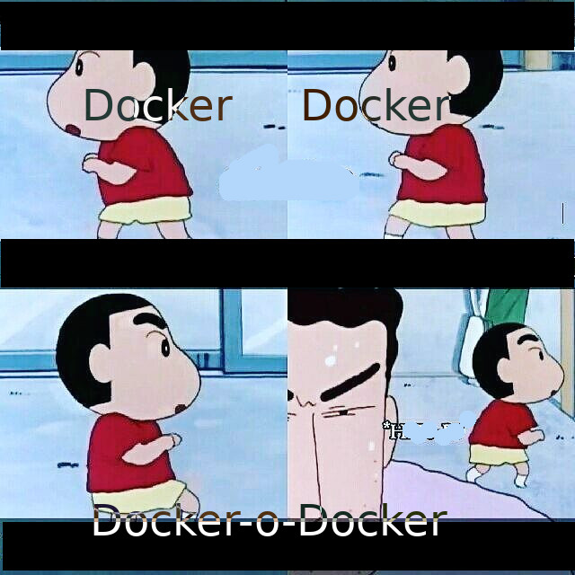

---

# Code and Coffee
> Chennai Docker Meetup: January 2018

---

## What are we doing today?
1. Quickstart: Docker 101
2. AMA
3. Lightning talks
4. Workshop
5. Endnote: Future of containers

---

## Quickstart

---

## Who am I?
- Mohanarangan Muthukumar
- github.com/extrasalt
- extrasalt.org

---

### Docker
- Cgroups and namespaces
- Application containers vs Machine containers
- Shipping your machine
- Communication only through ports

---

Pull the image
```
$ docker pull alpine
```

Run a command inside the container
```
$ docker run alpine ls -l
```

Create a container and attach to it
```
$ docker run -it alpine /bin/sh
```

---

```
$ docker ps -a
CONTAINER ID        IMAGE               COMMAND                  CREATED             STATUS                    PORTS               NAMES
75836ff40596        bfe2567e680b        "/bin/sh -c '#(nop..."   2 days ago          Created                                       loving_pasteur
84ba520e5ac8        postgres            "docker-entrypoint..."   2 weeks ago         Exited (0) 19 hours ago                       postgres
```

---

### What is orchestration?
- Manage resources
- Schedule tasks
- Monitoring
- Managing the tasks

---

## Swarm mode

---

Manager Node
```
$ docker swarm init --advertise-addr=192.168.2.5
```
Swarm node
```
$ docker swarm join \
    --token SWMTKN-1-43ae9q0vh499awlv7ojtgiuqz6zagze4wlaxh8gae50wxdi0nt-4ohknvwz3p45uqhptj9zh0ep8 \
    192.168.2.5:2377
```

---

- Easy to setup. Docker-machine and docker swarm init
- It has an internal raft implementation
- Imperative vs Declarative

---



---

@extrasaltorg

Thank you.
